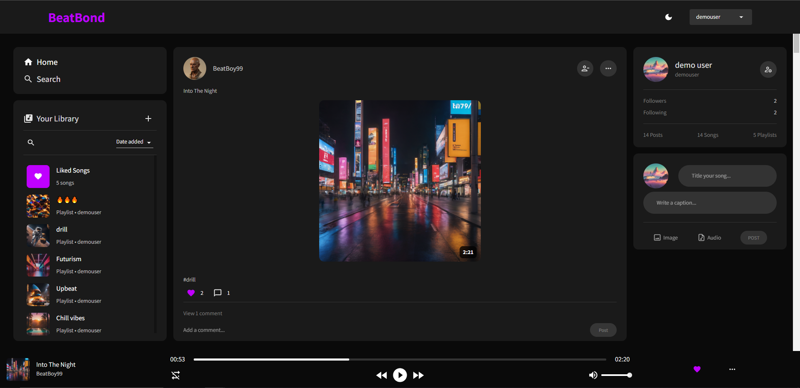
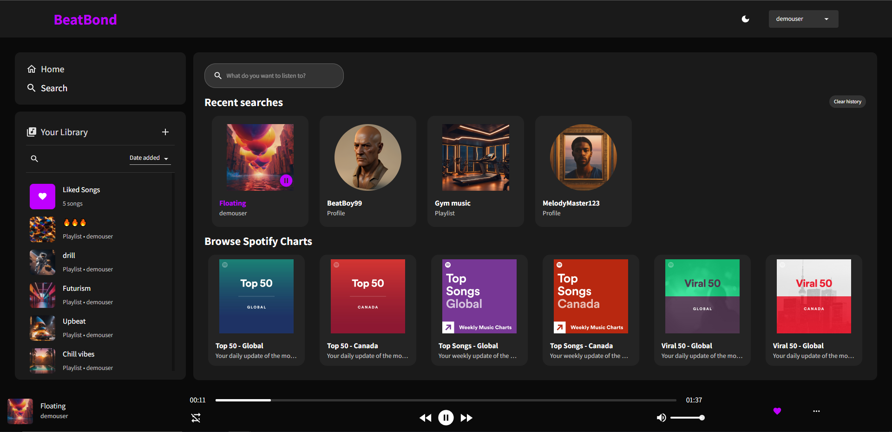
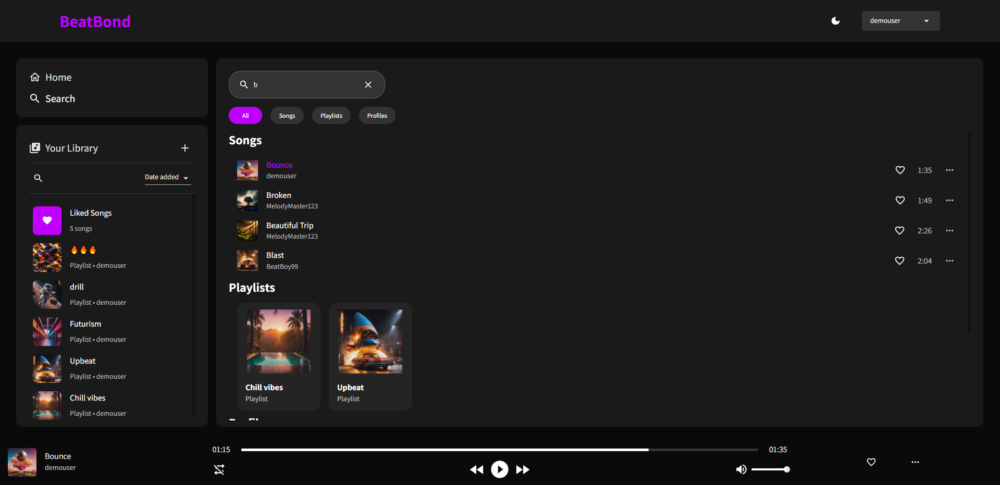
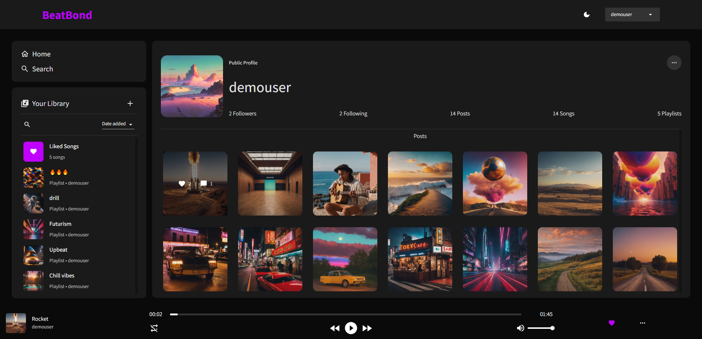
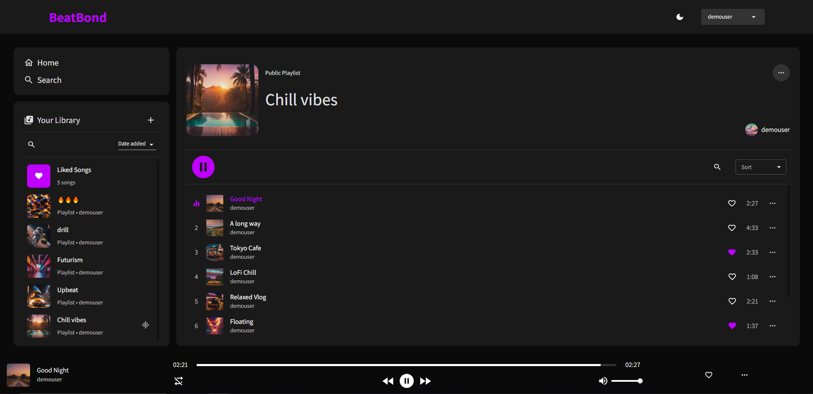

# BeatBond 🎶
## Description
BeatBond is a social media platform tailored for music lovers. Post and share your favourite songs, create playlists, and interact with other users who share your musical taste. BeatBond also integrates with Spotify API to bring you the latest charts!

## Live Application
The live deployment is currently suspended and is no longer available to access

## Features 🌟
- 🎵 Post, share, and listen to songs
- 📚 Create your own playlists
- 🌍 Explore Spotify charts
- 🔒 User authentication
- 🗳 Like, comment, and interact
- 💨 Real-time updates
- 📱 Mobile-responsive design

## Tech Stack 🛠️
- **Frontend**: React, Redux
- **Backend**: Node.js, Express
- **Database**: MongoDB
- **Cache**: Redis
- **File Storage**: AWS S3
- **Deployment**: Render

## How to Use 📘
1. **Sign Up / Login:** Securely create your own BeatBond account, or log in if you already have one.
2. **Discover Music:** Follow and search for users or browse through the Spotify charts.
3. **Post Songs:** Share your favorite songs and add them to playlists.
4. **Interact:** Like, comment, and share songs and playlists from other users.

## Screenshots
### Home Page

### Search Page

### Profile Page

### Playlist Page

